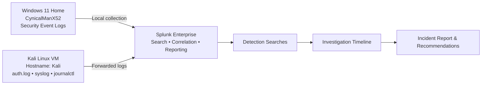
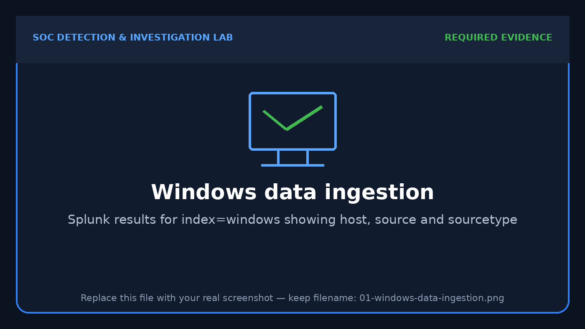
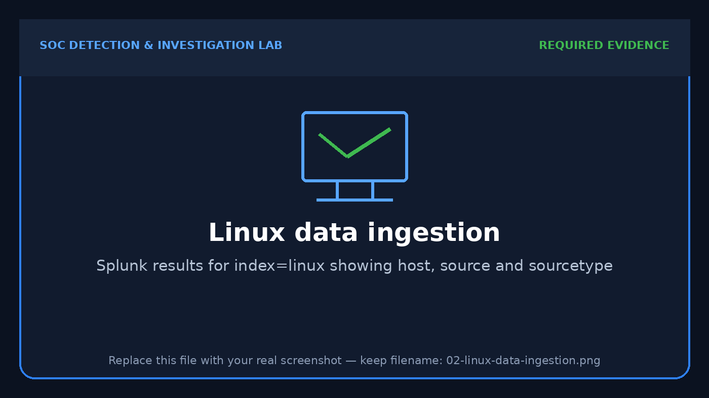
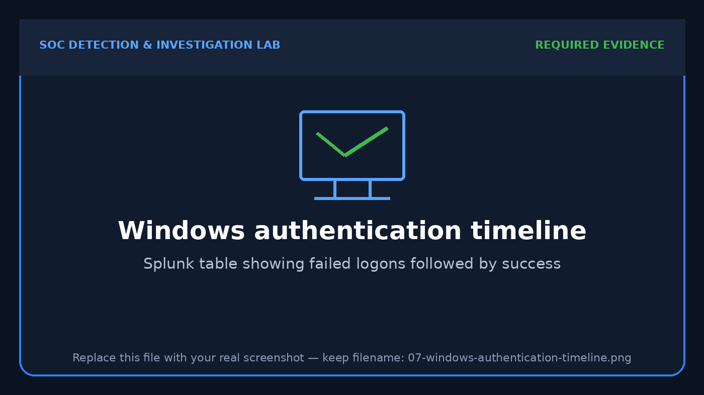
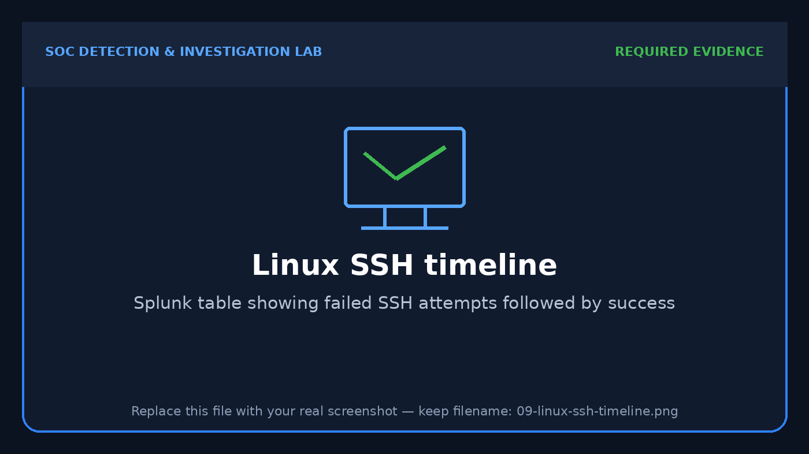

# SOC Detection & Investigation Lab — Splunk, Windows and Linux

[](https://www.splunk.com/)
[](https://www.microsoft.com/windows/)
[](https://www.kali.org/)
[](https://attack.mitre.org/)

## Executive Summary

This project demonstrates an end-to-end SOC monitoring workflow in a lightweight home lab. Windows Security events and Kali Linux authentication logs are ingested into Splunk, normalized with SPL, investigated as related security events, mapped to MITRE ATT&CK, and documented in an incident-report format.

The primary Windows investigation follows a controlled account-lifecycle sequence:

1. Local account `soclabuser` is created on `CynicalManX52`.
2. Multiple failed authentication attempts are generated.
3. A successful authentication follows.
4. Splunk is used to correlate the account creation and authentication activity into one timeline.

The Linux investigation monitors failed and successful SSH authentication activity from Kali Linux logs. All activity is an **authorized lab simulation** performed in an isolated environment.

## Skills Demonstrated

- SIEM onboarding and data validation
- Windows Security Event Log analysis
- Linux authentication-log analysis
- SPL searching, field normalization and aggregation
- Account creation and authentication monitoring
- Detection engineering and threshold design
- Alert triage and incident investigation
- Timeline reconstruction and evidence handling
- MITRE ATT&CK mapping
- Analyst recommendations and reporting

## Lab Architecture



## Environment

| Component | Configuration |
|---|---|
| Windows endpoint | Windows 11 Home |
| Windows hostname | `CynicalManX52` |
| Linux endpoint | Kali Linux in Oracle VM VirtualBox |
| Linux hostname | `Kali` |
| VirtualBox networking | NAT |
| SIEM | Splunk Enterprise on the Windows host |
| Splunk interface | `http://localhost:8000` |
| Windows index | `windows` |
| Linux index | `linux` |
| Test account | `soclabuser` |
| Windows telemetry | Security, System and Application event logs |
| Linux telemetry | Authentication, system and journal events |

## Detection Coverage

| Detection | Data source | Logic | ATT&CK mapping |
|---|---|---|---|
| New local Windows account | Security Event ID 4720 | Identify newly created accounts and the actor | T1136.001 — Create Account: Local Account |
| Repeated Windows logon failures | Security Event ID 4625 | Threshold failed attempts by account and host | T1110.001 — Password Guessing |
| Failed logons followed by success | Event IDs 4625 and 4624 | Correlate authentication outcome for one account | T1078 — Valid Accounts |
| Local administrator-group change | Security Event ID 4732 | Identify membership additions to a local group | T1098.007 — Additional Local or Domain Groups |
| Repeated SSH failures | Linux authentication logs | Extract account and source IP, then apply a threshold | T1110.001 — Password Guessing |
| SSH failure followed by success | Linux authentication logs | Reconstruct failed and accepted SSH activity | T1021.004 — SSH; T1078 — Valid Accounts |
| Sudo activity | Linux authentication logs | Review privileged command execution and failures | T1548.003 — Sudo and Sudo Caching |

## Evidence Gallery

### Data Ingestion

| Windows events in Splunk | Linux events in Splunk |
|---|---|
|  |  |

### Authentication Investigations

| Windows failure-to-success sequence | Linux SSH sequence |
|---|---|
|  |  |

### Correlated Incident Timeline


## Investigation Summary

The Windows sequence is assessed as a **medium-severity true positive simulation**. The account creation, repeated failed logons and later successful logon were intentionally generated, but the same pattern in a production environment could indicate unauthorized account creation, password guessing or credential misuse. The investigation therefore prioritizes authorization checks, source validation, group-membership review and post-authentication activity.

The Linux SSH sequence is also treated as a controlled true positive. Failed and accepted authentication records are extracted from raw Linux events and correlated by username, source address, host and time.

## Repository Structure

```text
SOC-Detection-Investigation-Lab-Splunk/
├── README.md
├── START-HERE.md
├── docs/
│   ├── 01-architecture-and-environment.md
│   ├── 02-data-onboarding-and-validation.md
│   ├── 03-windows-investigation.md
│   ├── 04-linux-investigation.md
│   ├── 05-incident-report.md
│   ├── 06-detection-engineering-notes.md
│   └── 07-lessons-learned.md
├── detections/
│   ├── windows/
│   ├── linux/
│   ├── correlation/
│   └── validation/
├── setup/
├── screenshots/
│   ├── required/
│   └── optional/
├── sample-data/
└── assets/
```

## Documentation

- [Architecture and environment](docs/01-architecture-and-environment.md)
- [Data onboarding and validation](docs/02-data-onboarding-and-validation.md)
- [Windows investigation](docs/03-windows-investigation.md)
- [Linux investigation](docs/04-linux-investigation.md)
- [Incident report](docs/05-incident-report.md)
- [Detection-engineering notes](docs/06-detection-engineering-notes.md)
- [Lessons learned](docs/07-lessons-learned.md)
- [Detection catalogue](detections/README.md)

## Analyst Conclusion

This lab demonstrates the complete workflow expected from an entry-level SOC analyst: validate data, identify relevant events, normalize fields, correlate activity, assess severity, map behavior to ATT&CK, collect evidence and recommend response actions. It is intentionally scoped for a resource-constrained personal laptop while retaining realistic SOC investigation practices.

## Author

**Manu Singh Kanwar**  
Aspiring SOC Analyst | MS Cybersecurity Operations  
[LinkedIn](https://www.linkedin.com/in/manu-kanwar-cybersecurity)

> Safety note: Commands and authentication tests in this repository are intended only for systems you own or are explicitly authorized to test.
