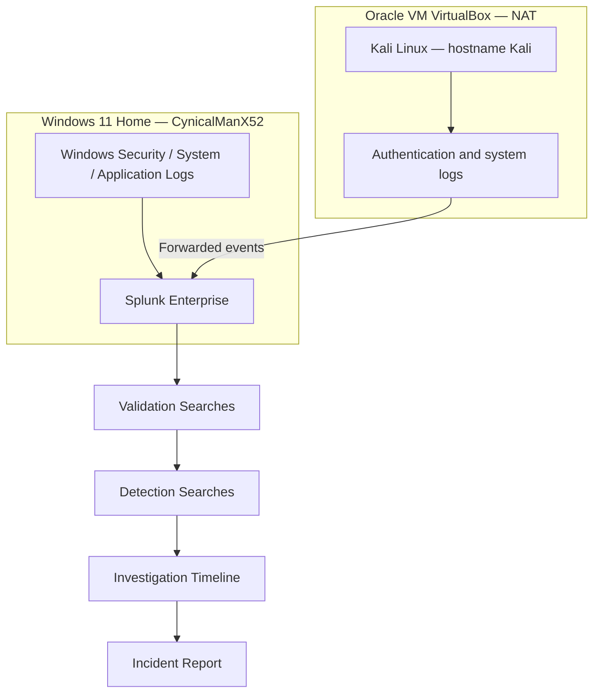

# Architecture and Environment

## Objective

Build a lightweight monitoring environment that demonstrates endpoint-log collection, SIEM validation, detection development and incident investigation without requiring enterprise infrastructure.

## Architecture

## Components

| Component | Role in the lab |
|---|---|
| Windows 11 Home | Host endpoint and source of Windows Security events |
| Splunk Enterprise | Central search, monitoring and investigation platform |
| Oracle VM VirtualBox | Hosts the Kali Linux virtual machine |
| Kali Linux | Linux endpoint and authentication-log source |
| Windows Event Viewer | Native confirmation of Security Event IDs |
| Linux authentication logs | Evidence for SSH and sudo investigations |

## Logical Data Flow

1. Windows events are generated locally on `CynicalManX52`.
2. Selected Windows channels are collected by Splunk.
3. Kali authentication and system events are forwarded to the Splunk instance.
4. Validation searches confirm index, host, source and sourcetype values.
5. Detection searches normalize field variations and identify suspicious sequences.
6. Investigation searches reconstruct the sequence in chronological order.
7. Evidence and analyst conclusions are documented in Markdown.

## Scope Decisions

The laptop has limited memory, so the lab prioritizes native Windows and Linux logs rather than running multiple heavy security products simultaneously. Sysmon, Wazuh, Microsoft Sentinel and additional virtual machines can be introduced in separate projects.

## Security and Privacy

- All tests are performed only in the user's own lab.
- Passwords are not committed to GitHub.
- Screenshots are cropped to remove unrelated personal information.
- Public IP addresses, tokens and credentials are masked before publication.
