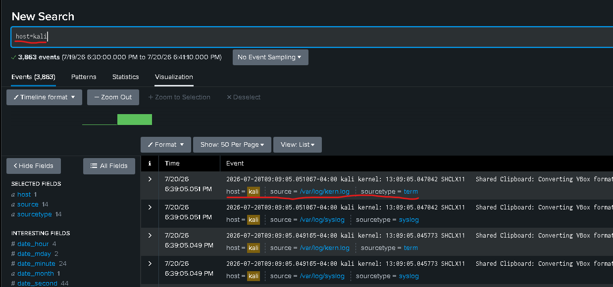

# Data Onboarding and Validation

## Purpose

A detection is trustworthy only when the analyst first confirms that the expected data is arriving consistently and with usable fields. This stage validates the Windows and Linux indexes before any alert logic is applied.

## Windows Data

| Data source | Index | Primary use |
|---|---|---|
| Windows Security Event Log | `windows` | Account creation, logon success/failure, privilege and group changes |
| Windows System Event Log | `windows` | Service, startup, driver and operating-system events |
| Windows Application Event Log | `windows` | Application and service errors |
| PowerShell Operational | `windows` | Optional command and script telemetry |

### Validation Search

```spl
host="CynicalManX52"
| stats count AS events min(_time) AS first_seen max(_time) AS last_seen BY host source sourcetype
| convert ctime(first_seen) ctime(last_seen)
| sort 0 - events
```


### Validation Criteria

- The expected Windows host is visible as `CynicalManX52`.
- Security events are present in `host="CynicalManX52"`.
- Event IDs 4720, 4625 and 4624 can be searched.
- Event timestamps match the time of the test activity.
- Account and host fields can be identified in the raw event.

## Linux Data

| Data source | Index | Primary use |
|---|---|---|
| Authentication log or journal | `linux` | SSH, sudo and authentication events |
| System log or journal | `linux` | Services and general operating-system activity |
| APT/DPKG logs | `linux` | Optional package-installation monitoring |

### Validation Search

```spl
host="kali"
| stats count AS events min(_time) AS first_seen max(_time) AS last_seen BY host source sourcetype
| convert ctime(first_seen) ctime(last_seen)
| sort 0 - events
```



### Validation Criteria

- The expected Linux host is visible as `Kali` or the configured forwarder host value.
- SSH or authentication text is searchable in `host="kali"`.
- Both failed and accepted authentication events are present.
- The username and source address can be extracted from `_raw`.
- Event time is aligned with the Windows/Splunk host time.

## Field Normalization

Windows field names can vary by source type. The detection searches use `coalesce()` to select the first populated equivalent field, for example:

```spl
| eval user=coalesce(TargetUserName, Account_Name, user)
| eval src_ip=coalesce(IpAddress, Source_Network_Address, src_ip)
| eval logon_type=coalesce(LogonType, Logon_Type)
```

This keeps the searches readable while making them more tolerant of different Windows event extractions.

## Data-Quality Risks

| Risk | Effect | Analyst response |
|---|---|---|
| Incorrect time range | Relevant activity appears missing | Expand the search range and confirm system clocks |
| Wrong index | Search returns no results | Run an index inventory search |
| Missing audit category | Expected Windows event is never generated | Enable the relevant audit policy |
| Unparsed Linux event | Username/source fields are blank | Review `_raw` and adjust the `rex` expression |
| High-volume 4624 events | Timeline contains service or machine logons | Filter by the test account and inspect logon type |
