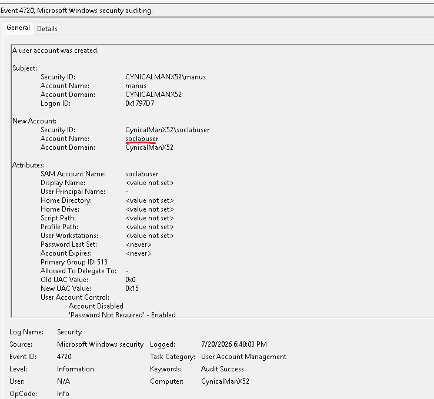
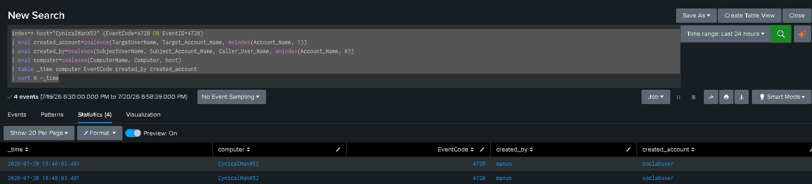
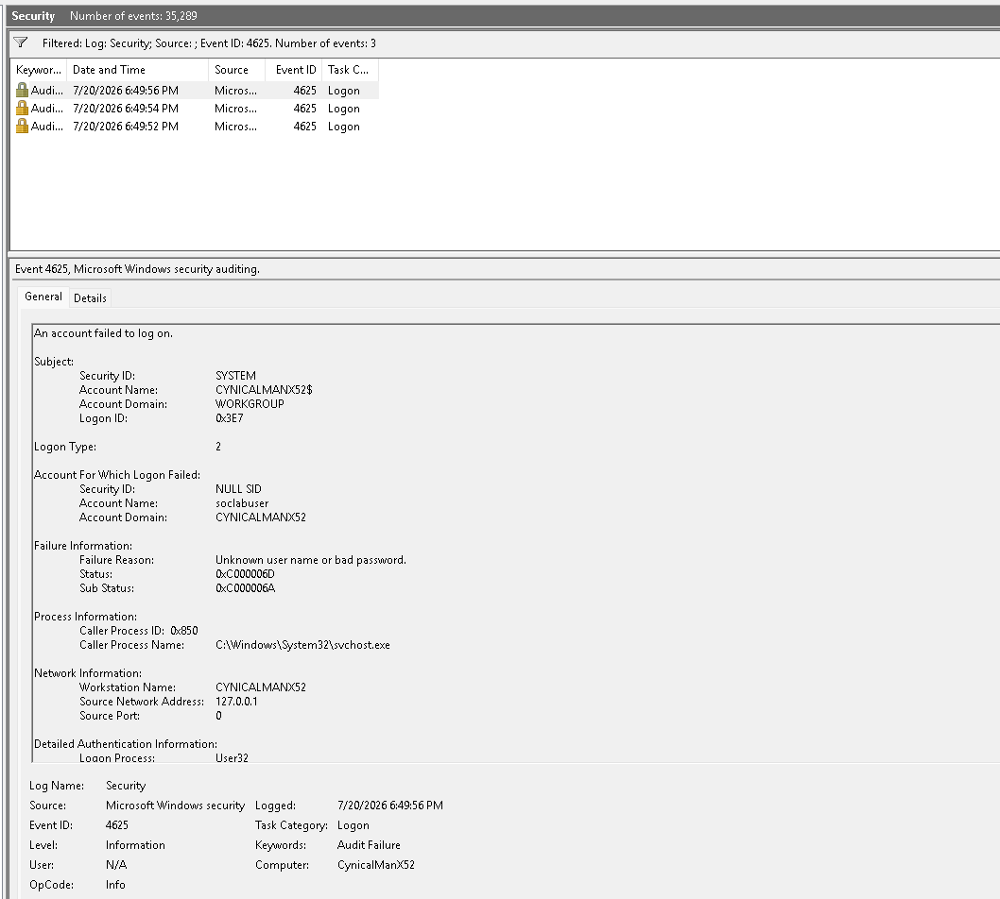
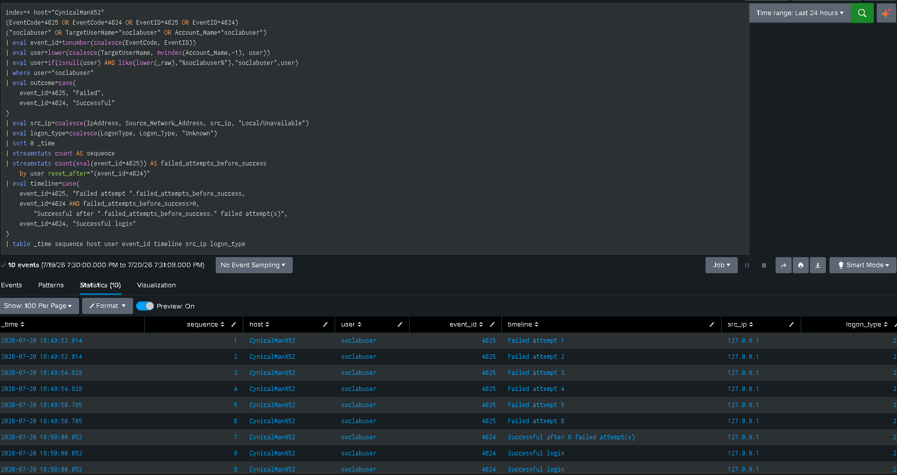

# Windows Investigation — New Account Followed by Failed and Successful Logons

## Investigation Question

Was the newly created local account `soclabuser` used in repeated failed authentication attempts and then successfully authenticated on `CynicalManX52`?

## Data Sources

- Splunk index: `host="CynicalManX52`
- Windows Security Event Log
- Event ID 4720 — user account created
- Event ID 4625 — account failed to log on
- Event ID 4624 — account successfully logged on
- Event ID 4732 — member added to a local security group, optional

## Step 1 — Confirm Account Creation

```spl
index=* host="CynicalManX52" (EventCode=4720 OR EventID=4720)
| eval created_account=coalesce(TargetUserName, Target_Account_Name, mvindex(Account_Name, 1))
| eval created_by=coalesce(SubjectUserName, Subject_Account_Name, Caller_User_Name, mvindex(Account_Name, 0))
| eval computer=coalesce(ComputerName, Computer, host)
| table _time computer EventCode created_by created_account
| sort 0 -_time
```

### Evidence





### Analyst Finding

The Windows Security log records creation of the local account `soclabuser` on `CynicalManX52`. Event ID 4720 establishes the beginning of the account lifecycle and identifies the account that performed the creation when the source field is available.

## Step 2 — Review Failed Authentication

```spl
index=* host="CynicalManX52" (EventCode=4625 OR EventID=4625)
| eval user=coalesce(TargetUserName, Account_Name, user)
| eval src_ip=coalesce(IpAddress, Source_Network_Address, src_ip)
| eval logon_type=coalesce(LogonType, Logon_Type)
| where isnotnull(user) AND user!="-" AND user!=""
| bin _time span=10m
| stats count AS failed_attempts
        values(src_ip) AS source_ips
        values(logon_type) AS logon_types
        by _time host user
| sort 0 -failed_attempts
```



### Analyst Finding

Multiple Event ID 4625 records show unsuccessful authentication attempts involving `soclabuser`. In this lab, the activity was deliberately generated with an incorrect password. In a production environment, the analyst would determine whether the failures resulted from user error, a stale service credential or password guessing.

## Step 3 — Confirm Successful Authentication

```spl
index=* host="CynicalManX52"
(EventCode=4625 OR EventCode=4624 OR EventID=4625 OR EventID=4624)
("soclabuser" OR TargetUserName="soclabuser" OR Account_Name="soclabuser")
| eval event_id=tonumber(coalesce(EventCode, EventID))
| eval user=lower(coalesce(TargetUserName, mvindex(Account_Name,-1), user))
| eval user=if(isnull(user) AND like(lower(_raw),"%soclabuser%"),"soclabuser",user)
| where user="soclabuser"
| eval outcome=case(
    event_id=4625, "Failed",
    event_id=4624, "Successful"
)
| eval src_ip=coalesce(IpAddress, Source_Network_Address, src_ip, "Local/Unavailable")
| eval logon_type=coalesce(LogonType, Logon_Type, "Unknown")
| sort 0 _time
| streamstats count AS sequence
| streamstats count(eval(event_id=4625)) AS failed_attempts_before_success 
    by user reset_after="(event_id=4624)"
| eval timeline=case(
    event_id=4625, "Failed attempt ".failed_attempts_before_success,
    event_id=4624 AND failed_attempts_before_success>0,
        "Successful after ".failed_attempts_before_success." failed attempt(s)",
    event_id=4624, "Successful login"
)
| table _time sequence host user event_id timeline src_ip logon_type
```


### Analyst Finding

A later Event ID 4624 confirms that the account successfully authenticated. The successful event is not inherently malicious; its significance comes from its position after repeated failures and shortly after local account creation.

## Step 4 — Reconstruct the Authentication Timeline

```spl
index=* host="CynicalManX52" (EventCode=4732 OR EventID=4732)
| eval event_id=coalesce(EventCode, EventID)
| eval actor=coalesce(SubjectUserName, Caller_User_Name, Subject_Account_Name)
| eval group_name=coalesce(TargetUserName, GroupName, Group_Name)
| eval member=coalesce(MemberName, Member_ID, MemberSid)
| where like(lower(group_name), "%administrators%")
| table _time host event_id actor member group_name
| rename event_id AS EventCode group_name AS GroupName
| sort 0 -_time
```



## Triage Assessment

| Category | Assessment |
|---|---|
| Alert disposition | True positive — authorized simulation |
| Severity | Medium |
| Confidence | High when the event sequence and account fields are visible |
| Affected asset | `CynicalManX52` |
| Affected identity | `soclabuser` |
| Primary risk | Unauthorized account use or credential guessing |
| Escalation trigger | Unknown creator, remote source, privileged group membership or suspicious post-login execution |

## MITRE ATT&CK Mapping

| Observed behavior | Technique |
|---|---|
| Local account creation | T1136.001 — Create Account: Local Account |
| Repeated password failures | T1110.001 — Password Guessing |
| Successful use of the account | T1078 — Valid Accounts |
| Addition to a privileged local group, when performed | T1098.007 — Additional Local or Domain Groups |

## Analyst Recommendations

1. Confirm that the account creation was linked to an approved request.
2. Identify the user or process that created the account.
3. Review the failed-logon source, failure reason and logon type.
4. Compare the successful logon with the same account, host and source context.
5. Review local group membership and specifically check Administrators membership.
6. Search for commands, processes and network activity after the successful logon.
7. Disable the account and preserve evidence if the activity is unauthorized.
8. Apply account-lockout and password controls appropriate to the environment.
9. Create a correlation alert for account creation followed by authentication activity.
