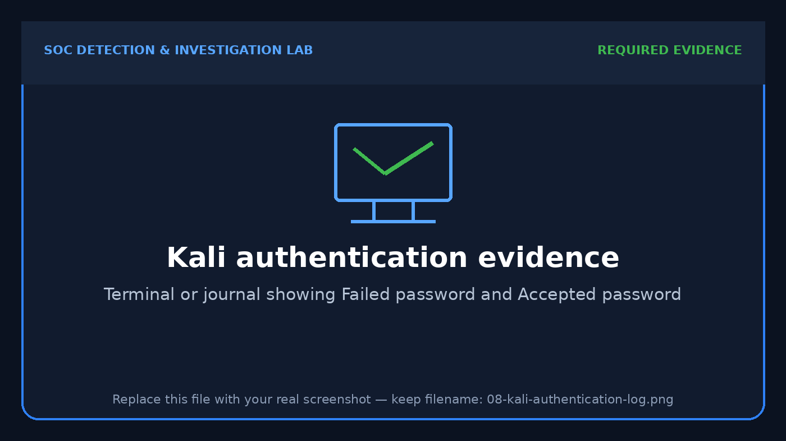

# Linux Investigation — SSH Authentication Monitoring

## Investigation Question

Did a Linux account receive repeated failed SSH authentication attempts followed by a successful login, and can the activity be correlated by username, source address and time?

## Data Sources

- Splunk index: `linux`
- Kali Linux authentication log or systemd journal
- SSH daemon messages containing `Failed password` and `Accepted password`
- Optional sudo authentication and command records

## Step 1 — Validate Raw Authentication Evidence

Useful local commands include:

```bash
sudo grep -E "Failed password|Accepted password" /var/log/auth.log
```

or, when authentication records are stored in the journal:

```bash
sudo journalctl -u ssh --no-pager
```



## Step 2 — Detect Repeated SSH Failures

```spl
index=linux "Failed password"
| rex field=_raw "Failed password for (?:invalid user )?(?<user>\S+) from (?<src_ip>\S+) port (?<src_port>\d+)"
| bin _time span=10m
| stats count as failed_attempts min(_time) as first_seen max(_time) as last_seen values(src_port) as source_ports by _time host user src_ip
| where failed_attempts >= 3
| convert ctime(first_seen) ctime(last_seen)
| sort - failed_attempts
```

## Step 3 — Reconstruct Failure and Success

```spl
index=linux ("Failed password" OR "Accepted password")
| rex field=_raw "(?<result>Failed|Accepted) password for (?:invalid user )?(?<user>\S+) from (?<src_ip>\S+) port (?<src_port>\d+)"
| eval outcome=if(result="Failed","Failed","Successful")
| table _time host outcome user src_ip src_port source
| sort 0 _time
```


## Analyst Finding

The authentication events provide a sequence of failed and accepted SSH activity. Extracting the username and source address from the raw message allows the analyst to determine whether the successful login is related to the preceding failures. In this lab, the activity is authorized; in production, the source reputation, account owner, geolocation, authentication method and post-login commands would require review.

## Triage Assessment

| Category | Assessment |
|---|---|
| Alert disposition | True positive — authorized simulation |
| Severity | Medium when repeated failures are followed by success |
| Primary data | SSH authentication messages |
| Key fields | `user`, `src_ip`, `src_port`, `host`, `_time`, `outcome` |
| Escalation trigger | Unknown source, privileged account, repeated targeting or suspicious sudo activity |

## MITRE ATT&CK Mapping

| Observed behavior | Technique |
|---|---|
| Password guessing | T1110.001 — Password Guessing |
| Successful use of credentials | T1078 — Valid Accounts |
| Remote access using SSH | T1021.004 — SSH |
| Privileged execution with sudo | T1548.003 — Sudo and Sudo Caching |

## Analyst Recommendations

1. Validate whether the source address is expected.
2. Determine whether other usernames were targeted from the same source.
3. Check whether the accepted login used the same source as the failures.
4. Review the account's sudo activity and commands after login.
5. Prefer key-based SSH authentication where operationally appropriate.
6. Restrict SSH exposure using host firewall and network controls.
7. Apply rate limiting or automated blocking after repeated failures.
8. Disable direct remote root login and use least privilege.
