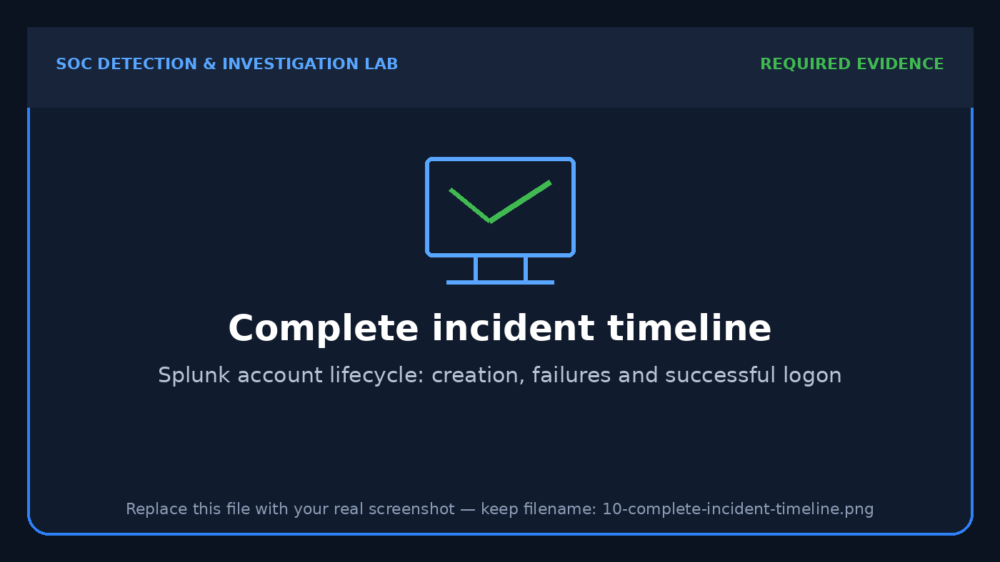

# Incident Report — Local Account Creation and Authentication Sequence

## Incident Metadata

| Field | Value |
|---|---|
| Incident title | New local Windows account followed by failed and successful authentication |
| Asset | `CynicalManX52` |
| Account | `soclabuser` |
| Detection platform | Splunk Enterprise |
| Primary log source | Windows Security Event Log |
| Severity | Medium |
| Disposition | True positive — authorized lab simulation |
| Status | Closed after validation and documentation |

## Executive Summary

A new local Windows account named `soclabuser` was created on `CynicalManX52`. Multiple failed authentication attempts were then generated for the account, followed by a successful authentication. Splunk searches correlated Event IDs 4720, 4625 and 4624 into one chronological account-lifecycle timeline.

The activity was intentionally produced in an isolated home lab. In a business environment, the same sequence could represent unauthorized persistence, password guessing or misuse of newly created credentials. The incident is therefore documented at medium severity, with escalation criteria for unknown account creation, remote sources, privileged group assignment or suspicious activity after login.

## Detection Sources

- Splunk Enterprise
- Windows Security Event Log
- Event ID 4720 — account creation
- Event ID 4625 — failed authentication
- Event ID 4624 — successful authentication
- Event ID 4732 — local group membership addition, optional

## Correlation Search

```spl
index=windows (EventCode=4720 OR EventCode=4625 OR EventCode=4624 OR EventCode=4732)
("soclabuser" OR TargetUserName="soclabuser" OR Account_Name="soclabuser" OR MemberName="*soclabuser*")
| eval activity=case(
    EventCode=4720,"Account Created",
    EventCode=4625,"Failed Logon",
    EventCode=4624,"Successful Logon",
    EventCode=4732,"Added to Local Group",
    true(),"Other"
  )
| eval actor=coalesce(SubjectUserName, Caller_User_Name)
| eval target=coalesce(TargetUserName, Account_Name, MemberName)
| eval src_ip=coalesce(IpAddress, Source_Network_Address, src_ip)
| eval logon_type=coalesce(LogonType, Logon_Type)
| table _time host EventCode activity actor target src_ip logon_type GroupName
| sort 0 _time
```



## Reconstructed Timeline

| Sequence | Event | Event ID | Interpretation |
|---:|---|---:|---|
| 1 | Local account created | 4720 | Establishes the new identity and creator context |
| 2 | Failed authentication attempts | 4625 | Shows unsuccessful attempts to use the new account |
| 3 | Successful authentication | 4624 | Confirms that a logon session was eventually created |
| 4 | Local group change, if generated | 4732 | Determines whether privileges were increased |

## Analysis

The strongest indicator is not any single event but the relationship between the events. Account creation may be legitimate, and password failures are common. A successful logon is also expected behavior. However, the combination of a newly created account, repeated failures and later success within a short period increases the need for validation.

The investigation should answer four questions:

1. Was the account creation authorized?
2. Did the same identity and asset appear throughout the sequence?
3. Did the successful authentication originate from expected local or network context?
4. Was the account granted additional privileges or used for suspicious execution afterward?

In the lab, the activity is a confirmed authorized simulation. No containment is required beyond documenting and cleaning up the test account after evidence collection.

## Severity Rationale

**Medium** severity is appropriate for the simulated pattern because it combines account creation with repeated failures and later success. The severity would increase to high if the account creator were unknown, the successful login originated remotely from an untrusted source, the account entered the Administrators group or suspicious PowerShell/process activity followed.

## MITRE ATT&CK

- T1136.001 — Create Account: Local Account
- T1110.001 — Password Guessing
- T1078 — Valid Accounts
- T1098.007 — Additional Local or Domain Groups, when privileged group membership is modified

## Recommended Response in a Production SOC

1. Validate the account against the identity-management or change record.
2. Contact the system owner or account requester.
3. Disable the account immediately if authorization cannot be established.
4. Preserve the relevant Windows and Splunk evidence.
5. Reset credentials and review other systems using the same identity.
6. Examine source address, logon type and authentication package.
7. Review group membership and privilege changes.
8. Search for processes, PowerShell activity, services and outbound connections after login.
9. Hunt for similar account creation or authentication sequences on other endpoints.
10. Tune a correlation alert using an appropriate time window and failure threshold.

## Closure

The activity was reproduced successfully in the lab, detected in Splunk and documented as an authorized true positive. The incident is closed after evidence capture and validation of the account-lifecycle timeline.
